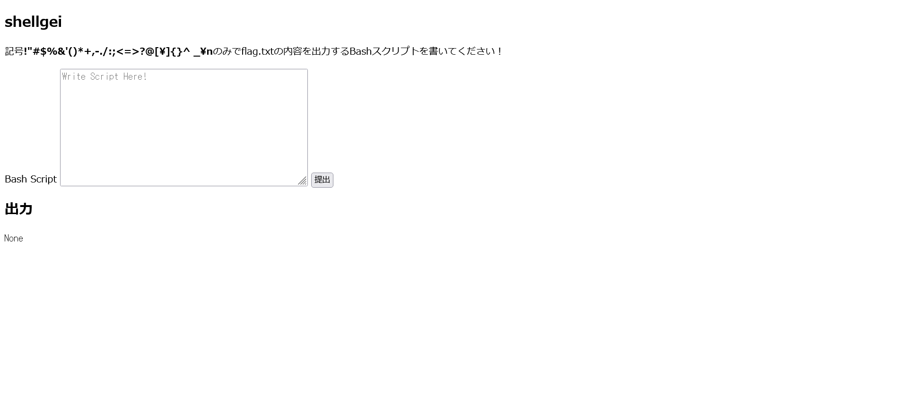
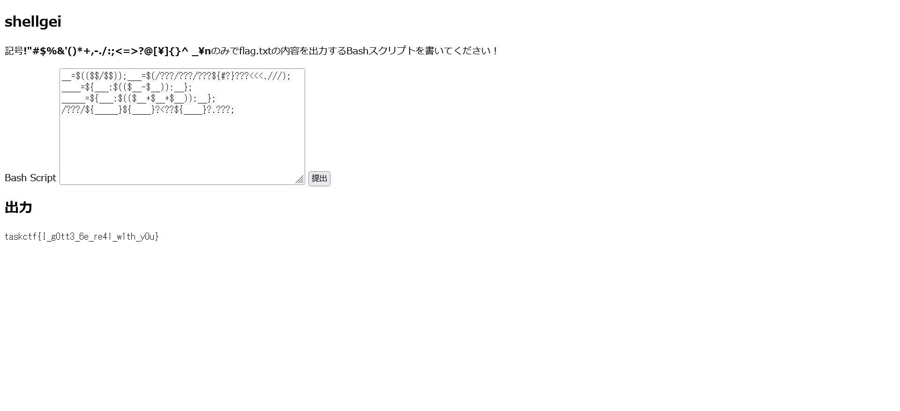

# shellgei:misc:491pts
記号のみのBashスクリプトでFlagを表示してください！  

[http://34.82.208.2:34345/](http://34.82.208.2:34345/)  

[files.zip](files.zip)　[files_v4.zip](files_v4.zip)  

Hint  
参考文献はこちらです。  
- [記号と英字2文字だけでbash](https://www.ryotosaito.com/blog/?p=178)  
- [記号だけでシェルは操れた](https://www.ryotosaito.com/blog/?p=194)  

# Solution
URLとソースが配布される(問題に修正が入ったようで複数のソースとなっている)。  
アクセスすると記号`!"#$%&'()*+,-./:;<=>?@[\]{}^ _\n`のみで書かれたBash Scriptを実行してくれるようだ。  
  
「bash シェル芸 記号」でググると[参考になりそうな記事](https://gist.github.com/greymd/455a13bb6f757c5ccd00bfb155d525e2)が見つかる。  
この記事では`/???/???/???${#?}???<<<_.`を実行すると、`/usr/bin/sha1sum`の結果より文字0から9とaからfを取得できることがわかる。  
この手法を応用し、`/???/ca?<??a?.???`を実行すると、`/bin/cat<flag.txt`となりフラグが表示されると予測できる。  
つまり`a`と`c`のみ持ってこればよい。  
適当に試していると`/???/???/???${#?}???<<<.///`で`a72c806d375d66d3bb9e524c7e2c01b9b35f0141 -`が返って来ることがわかり、1文字目と4文字目が`a`と`c`であることがわかる。  
これらをうまく持ってこればよい。  
以下のように行う。  
```bash
__=$(($$/$$)); #1
___=$(/???/???/???${#?}???<<<.///); #a72c806d375d66d3bb9e524c7e2c01b9b35f0141 -
____=${___:$(($__-$__)):__}; #a
_____=${___:$(($__+$__+$__)):__}; #c
/???/${_____}${____}?<??${____}?.???; #/???/ca?<??a?.???
```
コメントを消した、以下を送信してやればよい。  
```
__=$(($$/$$));___=$(/???/???/???${#?}???<<<.///);____=${___:$(($__-$__)):__};_____=${___:$(($__+$__+$__)):__};/???/${_____}${____}?<??${____}?.???;
```
  
flagが得られた。  

## taskctf{I_g0tt3_6e_re4l_w1th_y0u}