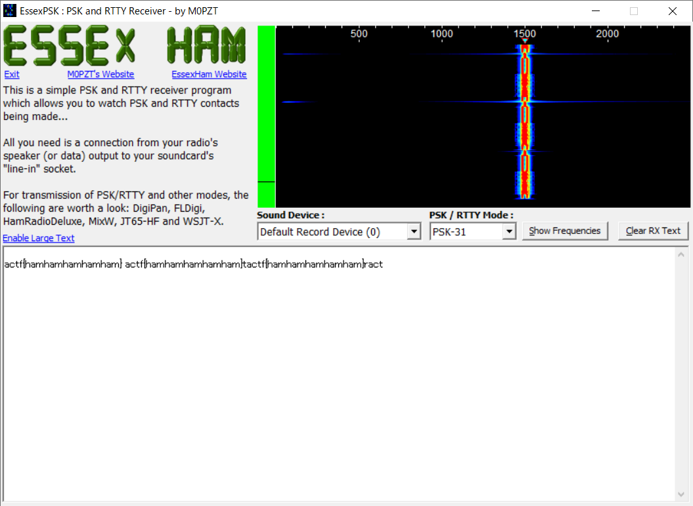

# PSK:Misc:90pts
My friend sent my yet another mysterious recording...  
He told me he was inspired by PicoCTF 2019 and made his own transmissions. I've looked at it, and it seems to be really compact and efficient.  
Only 31 bps!!  
See if you can decode [what he sent to me](transmission.wav). It's in actf{} format  

# Solution
PSK31を復調してやる。  
EssexPSKなるものを使用した(アナログで入力したのでノイズが混じっている)。  
  

## actf{hamhamhamhamham}