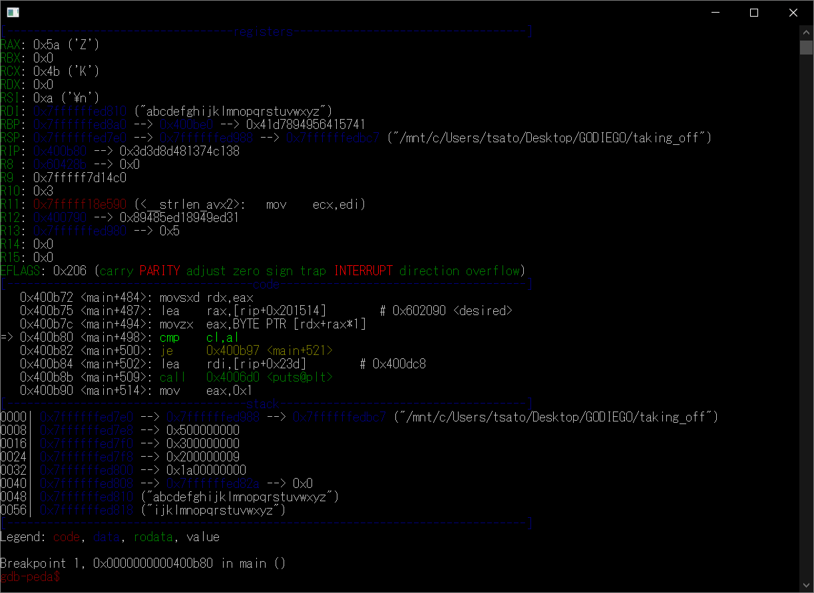

# Taking Off:Rev:70pts
So you started revving up, but is it enough to [take off](taking_off)? Find the problem in /problems/2020/taking_off/ in the shell server.  
Hint  
You should look into tools like GHIDRA, gdb, and objdump.  

# Solution
flagは運営サーバーのflag.txtにあるようだ。  
はじめにobjdumpを行う(taking_off.txt)。  
string_to_intを三回行っているので、コマンドライン引数に数字が含まれていると推測できる。  
次にstringsを行う。  
```text:taking_off_s.txt
~~~
flag.txt
Cannot read flag file.
So you figured out how to provide input and command line arguments.
But can you figure out what input to provide?
Make sure you have the correct amount of command line arguments!
chicken
Don't try to guess the arguments, it won't work.
Well, you found the arguments, but what's the password?
I'm sure it's just a typo. Try again.
Good job! You're ready to move on to bigger and badder rev!
~~~
```
見慣れないchickenという文字列がある。  
これもコマンドライン引数と比較していると推測できる。  
さらにIDAで解析する。  
グラフを見ると、はじめにコマンドライン引数の個数で分岐している。  
```asm
cmp     [rbp+var_B4], 5
```
さらにis_invalidで先頭三個のコマンドライン引数(string_to_intで数字になっている)を0から9の間に入っているか比較している。  
その後、何らかの計算をしてジャンプしているようだ。  
四個目のコマンドライン引数は推測通り、chickenのようだ。  
計算をアセンブリから求めてもよいが、総当たりした方が効率がよい(ヒットした場合入力待ちになる)。  
総当たりするシェルスクリプトを出力するプログラムは以下になる。  
```python:make_sh.py
for i in range(10):
    for j in range(10):
        for k in range(10):
            print("echo \"{} {} {}\"".format(i, j ,k))
            print("./taking_off {} {} {} chicken".format(i, j ,k))
```
これを実行した出力をファイル(bf.sh)へリダイレクトし、実行する。  
```text:出力
~~~
3 9 2
So you figured out how to provide input and command line arguments.
But can you figure out what input to provide?
Well, you found the arguments, but what's the password?

```
上記で停止したため、コマンドライン引数は3 9 2 chickenであるとわかる。  
コマンドライン引数は判明したが、パスワードが必要らしい。  
IDAのグラフやobjdumpの結果から一文字ずつループして比較しているようだ。  
これはstrchr、strlenからも推測できる  
結論として以下のレジスタを確認してやれば、どの文字と比較しているのかわかる。  
```asm
cmp     cl, al
```
パスワードをgdbで解析する。  
```bash
$ gdb --args taking_off 3 9 2 chicken
~~~
gdb-peda$ b *0x400b80
gdb-peda$ run
Starting program: /mnt/c/Users/tsato/Desktop/xxx/taking_off 3 9 2 chicken
So you figured out how to provide input and command line arguments.
But can you figure out what input to provide?
Well, you found the arguments, but what's the password?
abcdefghijklmnopqrstuvwxyz
~~~
gdb-peda$ i r $al
al             0x5a     0x5a
gdb-peda$ i r $cl
cl             0x4b     0x4b
gdb-peda$ set $cl = $al
gdb-peda$ c
```
breakpoint  
  
上記手順を繰り返すことでレジスタの値を解析したものが以下になる。  
```text
al
0x5a,0x46,0x4f,0x4b,0x59,0x4f,0xa,0x4d,0x43,0x5c,0x4f,0xa,0x4c,0x46,0x4b,0x4d,0x2a,0x0,0x0

cl
a,0x4b
b,0x48
c,0x49
d,0x4e
e,0x4f
f,0x4c
g,0x4d
h,0x42
i,0x43
j,0x40
k,0x41
l,0x46
m,0x47
n,0x44
o,0x45
p,0x5a
q,0x5b
r,0x58
s,0x59
t,0x5e
u,0x5f
v,0x5c
w,0x5d
x,----
y,----
z,----
```
比較文字(パスワード)はplease?give?flg?つまり、please give flag\nだとわかる。  
これによりflagを取得できる。  
```bash
@actf:~$ cd /problems/2020/taking_off/
@actf:/problems/2020/taking_off$ ls
flag.txt  taking_off
@actf:/problems/2020/taking_off$ ./taking_off 3 9 2 chicken
So you figured out how to provide input and command line arguments.
But can you figure out what input to provide?
Well, you found the arguments, but what's the password?
please give flag
Good job! You're ready to move on to bigger and badder rev!
actf{th3y_gr0w_up_s0_f4st}
```

## actf{th3y_gr0w_up_s0_f4st}