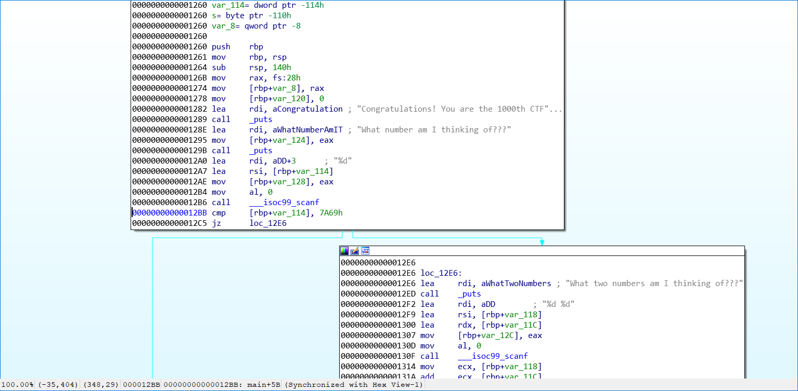
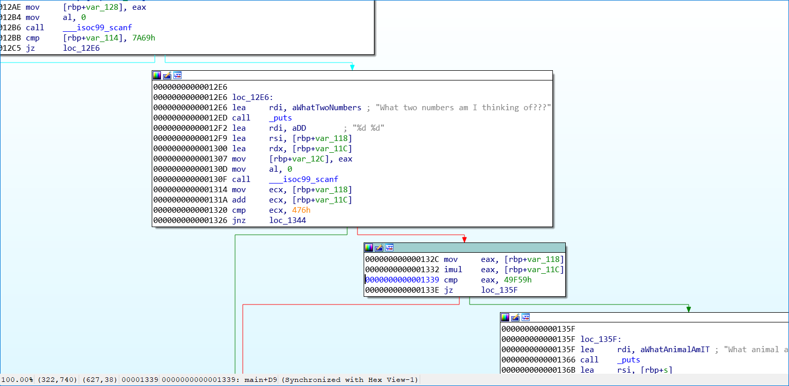
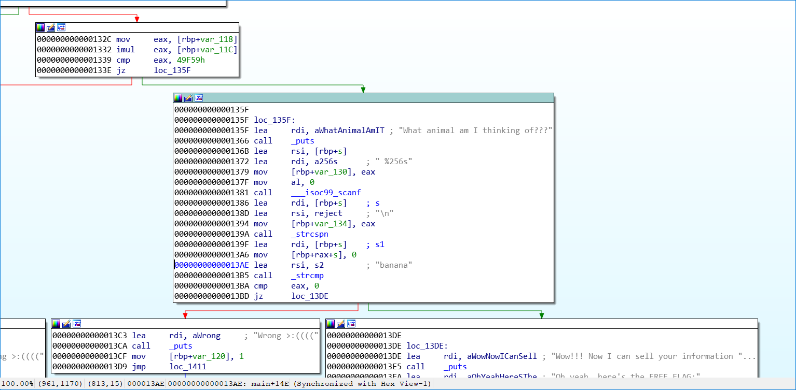

# FREE FLAGS!!1!!:Rev:50pts
Clam was browsing armstrongctf.com when suddenly a popup appeared saying "GET YOUR FREE FLAGS HERE!!!" along with [a download](free_flags). Can you fill out the survey for free flags?  
Find it on the shell server at `/problems/2021/free_flags` or over netcat at `nc shell.actf.co 21703`.  
Hint  
Check out decompilers like GHIDRA.  

# Solution
実行ファイルが配られる。  
入力を求められるので、IDAで解析する。  
  
初回の入力値は0x7a69(31337)と比較されていることがわかる。  
  
次は二つの入力を取り、和が0x476(1142)で積が0x49f59(302937)であるかを見ている。  
これを満たすのは(419,723)である。  
  
最後はbananaと文字列比較しているようだ。  
以下のように問題サーバに入力を行う。  
```bash
$ nc shell.actf.co 21703
Congratulations! You are the 1000th CTFer!!! Fill out this short survey to get FREE FLAGS!!!
What number am I thinking of???
31337
What two numbers am I thinking of???
419
723
What animal am I thinking of???
banana
Wow!!! Now I can sell your information to the Russian government!!!
Oh yeah, here's the FREE FLAG:
actf{what_do_you_mean_bananas_arent_animals}
```
flagが得られた。  

## actf{what_do_you_mean_bananas_arent_animals}