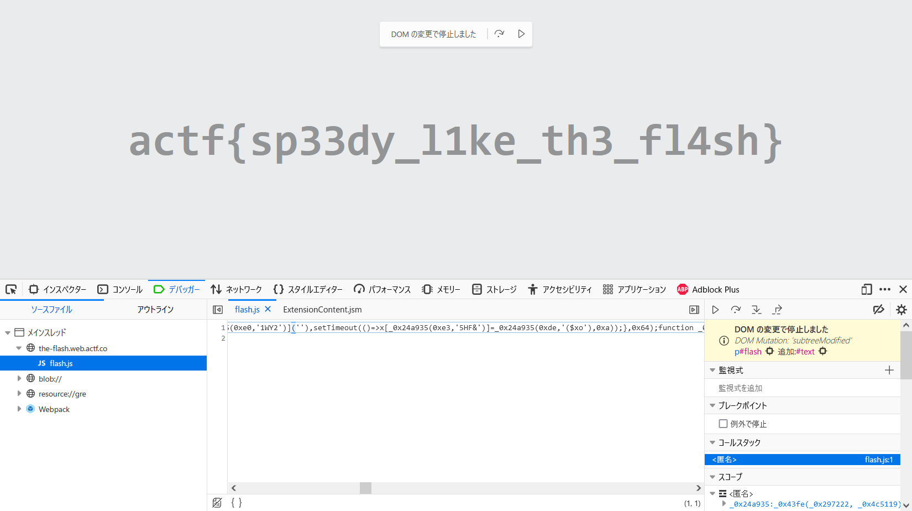

# The Flash:Web:40pts
The new Justice League movies nerfed the Flash, so clam made [his own rendition](https://the-flash.web.actf.co/)! Can you get the flag before the Flash swaps it out at the speed of light?  

Hint  
If only browsers had a way to inspect DOM changes...  

# Solution
アクセスすると偽フラグが表示されているサイトのようだ。  
The Flash  
[site.png](site/site.png)  
よく見ると一瞬だけ表示が変わる。  
jsで瞬間的に本物のフラグに差し替えているようだ。  
ブラウザの機能を用いて、変更にブレークポイントを設定してやればよい。  
  
flagでブレークした。  

## actf{sp33dy_l1ke_th3_fl4sh}