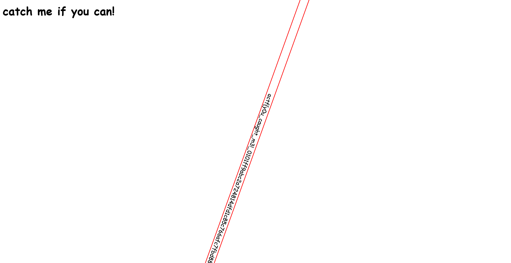

# catch me if you can:web:10pts
Somebody [help](https://catch-me-if-you-can.web.actf.co/)!  

# Solution
リンクが渡されるのでアクセスする。  
  
フラグらしきものが高速で回転しており、読むのが難しい。  
ソースを見てみる。  
```bash
$ curl https://catch-me-if-you-can.web.actf.co/
<html>
    <head>
~~~
    <body>
        <h1>catch me if you can!</h1>
        <marquee scrollamount="50" id="flag">actf{y0u_caught_m3!_0101ff9abc2a724814dfd1c85c766afc7fbd88d2cdf747d8d9ddbf12d68ff874}</marquee>
    </body>
</html>
```
flagが書かれていた。

## actf{y0u_caught_m3!_0101ff9abc2a724814dfd1c85c766afc7fbd88d2cdf747d8d9ddbf12d68ff874}