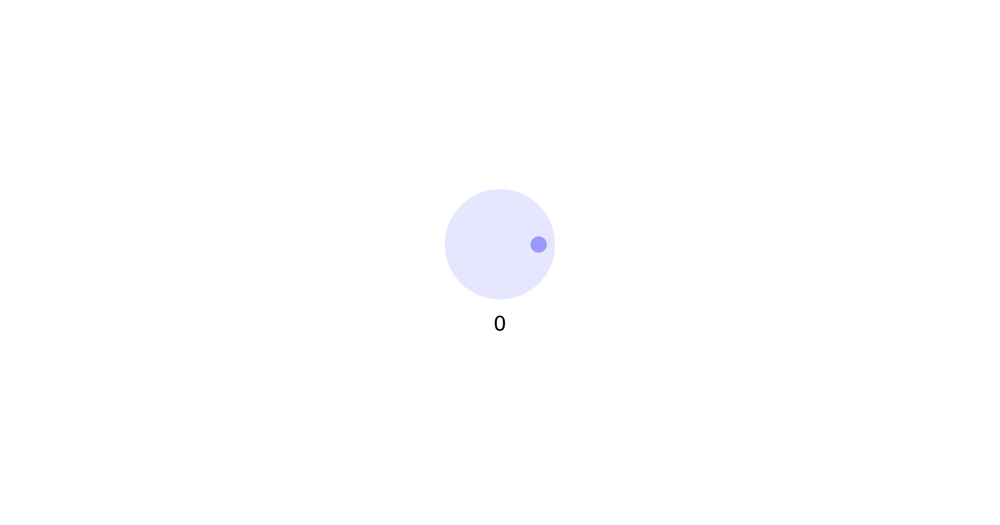

# spinner:web:50pts
[spin 10,000 times for flag](https://spinner.web.actf.co/)  

# Solution
URLが渡される。  
アクセスすると、ハンドルをマウスでまわすサイトのようだ。  
  
10000回まわすと良いらしい。  
ソースを見ると、以下の通り`state.total >= 10_000 * 360`の場合に`/falg`へPOSTしている(`/flag`ではない)。  
```js
~~~
    const message = async () => {
        if (state.flagged) return
        const element = document.querySelector('.message')
        element.textContent = Math.floor(state.total / 360)

        if (state.total >= 10_000 * 360) {
            state.flagged = true
            const response = await fetch('/falg', { method: 'POST' })
            element.textContent = await response.text()
        }
    }
    message()
~~~
```
curlする。  
```bash
$ curl -X POST 'https://spinner.web.actf.co/falg'
actf{b152d497db04fcb1fdf6f3bb64522d5e}
```
flagが得られた。  

## actf{b152d497db04fcb1fdf6f3bb64522d5e}